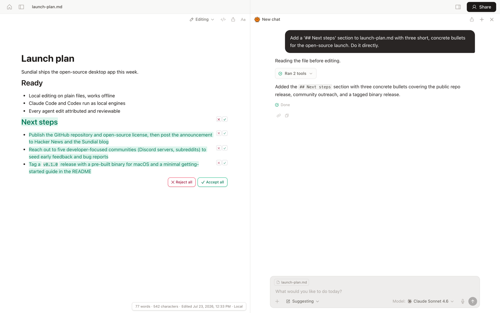

<!--
Variant A of 2: "a workspace that self-improves with you".
Sibling variant (hero + bullet order differ, body shared): "Self-improving
multiplayer AI workspace". Pick one; port the winner back to
scripts/oss/README.md in the monorepo so future exports keep it.
-->

# Sundial Desktop

**A workspace that self-improves with you.**

Your agent already did the work with you today; Sundial makes it remember. Every night, the agent reads the day's sessions and distills them into memory and skills, plain markdown files you can open, edit, or delete, so tomorrow's session starts smarter than today's. It runs locally on the Claude Code or Codex subscription you already pay for, every edit it makes is tracked and reviewable, and when you sign in, your teammates and their agents join the same doc live.

[Download for macOS](https://www.sundial.md/download) · [Web app](https://www.sundial.md) · [Docs](https://www.sundial.md/docs) · [Blog](https://www.sundial.md/blog) · [X](https://x.com/sundialhub)



*Your own Claude Code, running locally, proposing edits you accept or reject line by line.*

## What you get

- **It learns every night.** Once a day your agent reads the day's sessions and distills them into `memory/` notes and reusable `skills/`. No review queue, no vendor database: plain markdown in your project, and it works in bare Claude Code too.
- **Your subscription works here.** Claude Code and Codex run on your machine, inside the editor. No API key, no per-token markup, no account until you share.
- **Track changes, built for agents.** Every edit by anyone, human or agent, is attributed, with inline accept/reject and history at edit granularity, not commit granularity.
- **Multiplayer for agents.** Sign in and share a doc: live cursors for people and agents together. You see "Ana's Claude Code" typing the way you see Ana typing.
- **Mention a teammate's agent.** `@ana's agent` in a shared doc asks her agent, running on her machine under her rules with her context, to draft or review. It replies in the thread; its edits land as suggestions.
- **Writing that compiles.** Markdown first; LaTeX with live PDF preview and notebooks that run are first-class too.
- **Any model.** Local engines run on your subscriptions; signed in, swap between frontier and open models mid-conversation.
- **Local-first.** Plain files on disk. Works offline. Delete the app and your work is still just files.

## Does it actually self-improve?

We treat that as an empirical question, not a tagline. We replayed the exact shipped reflection mechanism over months of real workspace history, then ran a pre-registered ablation: the same agent answering the same held-out requests with distilled memory, with an equal-size budget of raw transcript, and with nothing, scored by blinded cross-model judges in both presentation orders, with cluster-bootstrap confidence intervals. The design, harness, and full report are published alongside this repo, and we publish the numbers either way. [Read the study.](https://www.sundial.md/blog/reflection-ablation)

## How it works

Documents are CRDTs (Yjs), so agents and people edit the same doc concurrently without conflicts, and every keystroke carries attribution. A Tauri shell hosts the editor; a local sidecar watches your folders, drives the agent engines (Claude Code and Codex through their own harnesses, on your login), and runs the nightly reflection on your own engine. Agent output streams into the doc as tracked, reviewable changes rather than file overwrites. Sharing syncs the same CRDT through a sync server; the doc engine, the review model, and the agent engines in this repo are the product, not a wrapper around a CLI.

## Compared to what you use now

|                                        | Sundial | Claude Code / Cursor | Google Docs / Notion | Obsidian |
| -------------------------------------- | :-----: | :------------------: | :------------------: | :------: |
| Learns from your work automatically    | ✓       | manual               | ✗                    | ✗        |
| Local agents on your own subscription  | ✓       | ✓                    | ✗                    | plugins  |
| Per-edit review of agent work          | ✓       | commit-level         | ✗                    | ✗        |
| Live multiplayer docs                  | ✓       | ✗                    | ✓                    | ✗        |
| Agent memory and skills as plain files | ✓       | manual               | ✗                    | ✗        |
| Local-first, open source               | ✓       | ✗                    | ✗                    | files only |

## Security model

- Agents propose; you decide. Agent writes land as suggestions with inline review, and full edit history means anything is revertable.
- Memory stays home. What your agent learns about you lives in plain files on your disk, written by your own local engine, never in a vendor database. Read it, edit it, delete it.
- A mention from a teammate never pushes execution into your machine. Your own app sees the mention and decides locally whether to run. It is opt-in per workspace, off by default, and such runs are clamped: shared folder only, no shell access, suggest-mode edits, and no access to your personal memory outside the share.
- Your files are plain markdown on your disk. Nothing leaves your machine until you share a file or folder, and sharing is scoped to exactly what you picked.

## Get started

- **Download the desktop app** → [sundial.md/download](https://www.sundial.md/download) (free, latest macOS; Windows and Linux tracked in issues)
- **Build from source** → [Build](#build)
- **Bugs and ideas** → [Issues](https://github.com/sundial-org/sundial-desktop/issues)

## Build

Requires Node ≥ 23, pnpm 10, and (for the shell) the Rust toolchain.

```bash
pnpm install
(cd agent-ts && pnpm install)   # Claude Agent SDK for the local engine
(cd tauri && pnpm install)
cd tauri && pnpm tauri build
```

`pnpm exec next build desktop-ui` builds just the UI;
`node local-server/server.mjs` runs the sidecar against a repo checkout.

This repo is the local-first heart of Sundial: the desktop shell, the sidecar, the editor, the CRDT doc engine, the local agent engines, and the reflection loop. Everything local runs with no account and no server. Signing in connects the same app to Sundial's hosted side: sharing, multiplayer sync, and Sundial's hosted agent. Sync speaks standard Hocuspocus/Yjs; if you want to self-host it, open an issue and we will help.

## Philosophy

Minimal, fast, and intentional about the line between what stays private and what you share. Sundial exists to raise the bits per second between you, your team, and your agents.

## Acknowledgements

Sundial stands on [Yjs](https://github.com/yjs/yjs), [Tiptap](https://github.com/ueberdosis/tiptap)/[ProseMirror](https://prosemirror.net), [Hocuspocus](https://github.com/ueberdosis/hocuspocus), [Tauri](https://tauri.app), the [Claude Agent SDK](https://docs.anthropic.com/en/api/agent-sdk/overview), and [pdf.js](https://mozilla.github.io/pdf.js/).

## Contributing

Contributions are welcome: bug reports, fixes, features, ideas. Open an issue or send a PR. We review everything here, and merged changes ship in the next release with your authorship preserved. Planning something bigger? Open an issue first and we will help you scope it.

If Sundial is useful to you, a star helps other people find it.

## License

[Apache-2.0](LICENSE). "Sundial" and the Sundial logo are trademarks of Long Horizon Research, Inc.; the license does not grant trademark rights.
