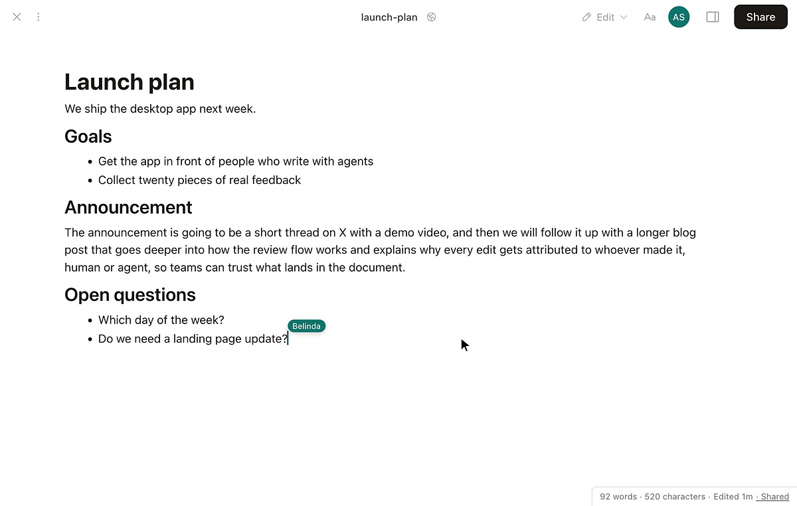
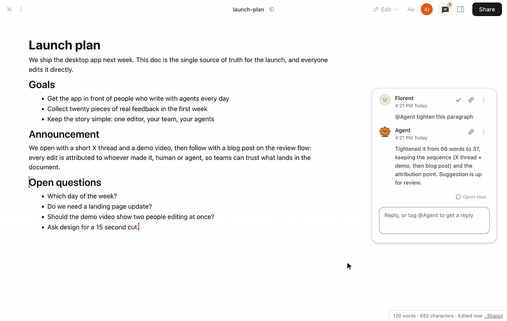
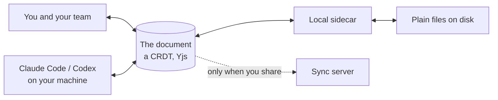

# Sundial Desktop

[](https://github.com/sundial-org/sundial-desktop/releases) [](LICENSE) [](https://x.com/sundialmd)

**Real-time multiplayer AI workspace.**

A Markdown editor where your team and your agents write in the same document, live. Claude Code and Codex join your docs as collaborators, on the subscription you already pay for. Every edit by anyone, human or agent, is attributed and reviewable.

Open source. Local-first. Runs on your own Claude Code and Codex.

[Download for macOS](https://www.sundial.md/download) · [Web app](https://www.sundial.md) · [Docs](https://www.sundial.md/docs) · [Discord](https://discord.gg/jHG5gDvyEQ) · [X](https://x.com/sundialmd)



*Select text, comment `@Agent tighten this`. The agent answers in the thread and its edit lands as a suggestion you accept or reject, while your teammate keeps typing.*

## Install and try it

**macOS.** [Download the app](https://www.sundial.md/download), drag it to Applications, open it. Free, no account needed.

**Windows / Linux.** Not built yet, tracked in [issues](https://github.com/sundial-org/sundial-desktop/issues); a star helps us prioritize.

**From source.** See [Build](#build).

**In the browser.** The same editor runs at [sundial.md](https://www.sundial.md/new) with a hosted agent, nothing to install. Documents you share from the app open there too.

Once it is open:

1. Open Sundial and point it at any folder of markdown, or start empty.
2. Select a sentence and comment `@Agent make this tighter`.
3. The agent replies in the thread and its edit shows up inline as a suggestion. Accept or reject it.
4. Share the doc with a teammate: their cursor, and their agent's edits, appear live.

## Features

- **Multiplayer for agents.** Teammates' cursors and their agents' edits appear live, attributed to whoever made them.
- **Your subscription works here.** Claude Code and Codex run on your machine, inside the editor. No API key, no account until you share.
- **Comment to delegate.** Tag `@Agent` on a selection; the fix lands as a suggestion on exactly those lines.
- **Track changes, built for agents.** Inline accept or reject, history at edit granularity, and every change links to the chat turn that made it.
- **Just Markdown on disk.** Callouts, wikilinks, footnotes, tables, Mermaid. An Obsidian vault opens as-is.
- **Any model.** Local engines run on your subscriptions; signed in, swap between frontier and open models mid-conversation.
- **Local by default.** Nothing syncs until you share a doc; stop sharing and you are fully local again.

## What people use it for

- Draft a doc with a teammate and an agent in the same file, live
- Let an agent rewrite while you are away, then read the authorship bands to see exactly what it changed
- Open an Obsidian vault as-is, and share one note with a link when it is ready
- Continue a Claude Code or Codex session from your terminal inside the editor
- Work on a plane: editing, review, and history are fully offline

## Works with

Claude Code · Codex · Claude, GPT, Gemini and open models through Sundial's hosted agent · GitHub, two-way · any folder on your disk



*Show authorship: the document colored by who wrote each line. Click a change to open the chat turn behind it.*

## Compared to what you use now

|                                        | Sundial | Claude Code / Cursor | Google Docs / Notion | Obsidian |
| -------------------------------------- | :-----: | :------------------: | :------------------: | :------: |
| Live multiplayer docs                  | ✓       | ✗                    | ✓                    | ✗        |
| Agents as live collaborators           | ✓       | single-player        | ✗                    | ✗        |
| Local agents on your own subscription  | ✓       | ✓                    | ✗                    | plugins  |
| Per-edit review of agent work          | ✓       | commit-level         | ✗                    | ✗        |
| Plain Markdown on your disk            | ✓       | ✓                    | ✗                    | ✓        |
| Local-first, open source               | ✓       | ✗                    | ✗                    | files only |

## How it works



Documents are CRDTs (conflict-free replicated data types, via Yjs): people and agents edit the same doc at once without conflicts, and every keystroke carries attribution. A local sidecar watches your folders and drives the agent engines on your own login; their output streams into the doc as tracked changes, not file overwrites. Sharing syncs the same CRDT through a Hocuspocus server; if you want to self-host sync, open an issue and we will help.

## FAQ

**Does my data leave my machine?** Not until you share a doc; sharing syncs only that doc through our cloud.

**Do I need an API key?** No. Sundial drives the Claude Code and Codex you already have, on your existing plan. Signed in, you can also use hosted models with no key.

**Can I use my Claude Max or ChatGPT plan?** Yes, that is the default: local engines run on your own login and subscription.

**What works offline?** Editing, comments, review, and history, fully. Agent turns need your model provider reachable; sharing and hosted models need Sundial's cloud.

## Security model

- Agents propose; you decide. Agent writes land as suggestions with inline review, and full edit history means anything is revertable.
- Your files are plain markdown on your disk, and sharing is scoped to exactly the files you picked.

## Build

Requires Node ≥ 23, pnpm 10, and (for the shell) the Rust toolchain.

```bash
pnpm install
(cd agent-ts && pnpm install)   # Claude Agent SDK for the local engine
(cd tauri && pnpm install)
cd tauri && pnpm tauri build
```

`pnpm exec next build desktop-ui` builds just the UI; `node local-server/server.mjs` runs the sidecar against a checkout.

## Philosophy

Minimal, fast, and intentional about the line between what stays private and what you share. Sundial exists to raise the bits per second between you, your team, and your agents.

## Acknowledgements

Sundial stands on [Yjs](https://github.com/yjs/yjs), [Tiptap](https://github.com/ueberdosis/tiptap)/[ProseMirror](https://prosemirror.net), [Hocuspocus](https://github.com/ueberdosis/hocuspocus), [Tauri](https://tauri.app), the [Claude Agent SDK](https://docs.anthropic.com/en/api/agent-sdk/overview), and [pdf.js](https://mozilla.github.io/pdf.js/).

## Contributing

Contributions are welcome: bug reports, fixes, features, ideas. Open an issue or send a PR. If we take your PR, we carry it into our monorepo with your authorship preserved and it ships in the next export ([docs/CONTRIBUTING.md](docs/CONTRIBUTING.md) explains why). Planning something bigger? Open an issue first and we will help you scope it.

If Sundial is useful to you, a star helps other people find it.

## Community

[Discord](https://discord.gg/jHG5gDvyEQ) to talk to us and other users · [X @sundialmd](https://x.com/sundialmd) for what we're building · [Issues](https://github.com/sundial-org/sundial-desktop/issues) for bugs and ideas.

## License

[Apache-2.0](LICENSE)
